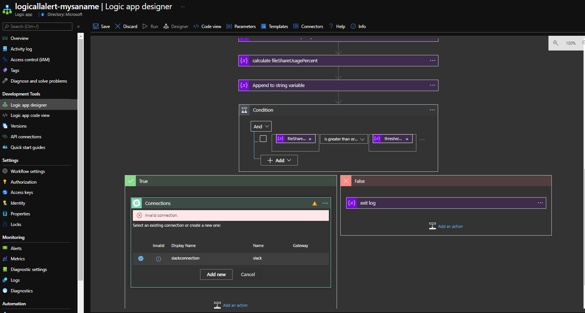
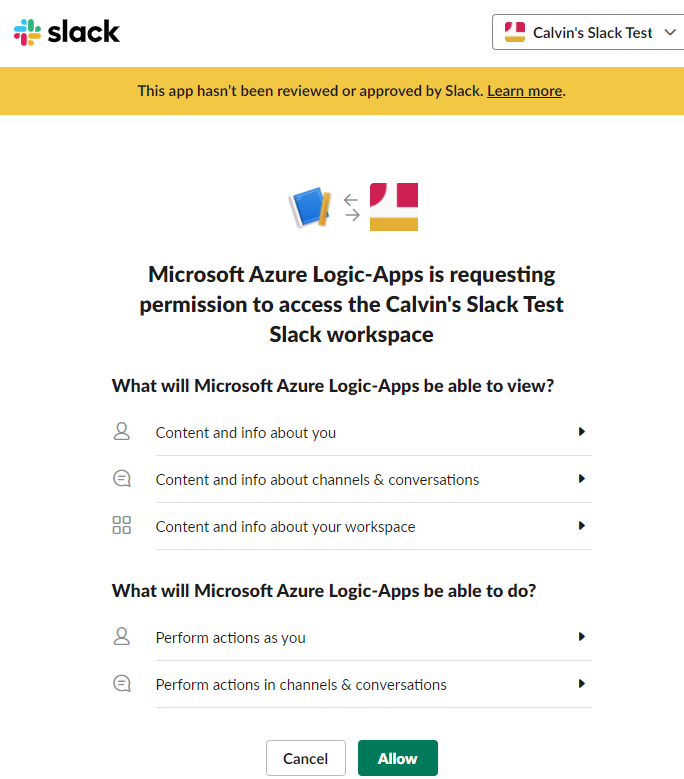
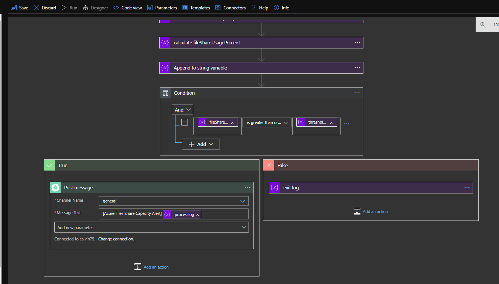
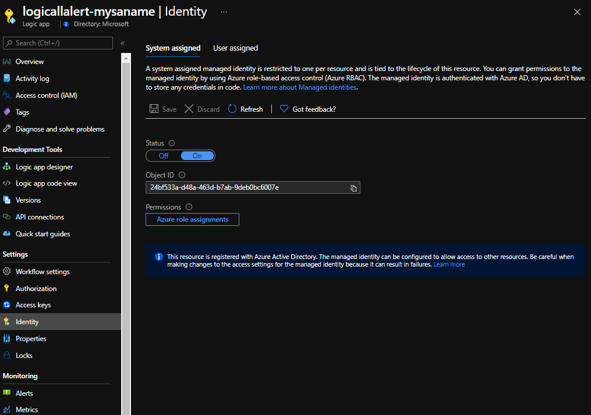
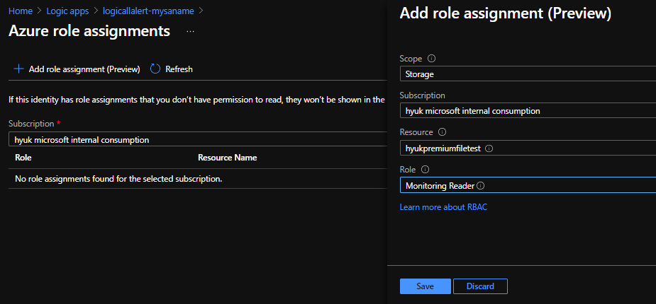
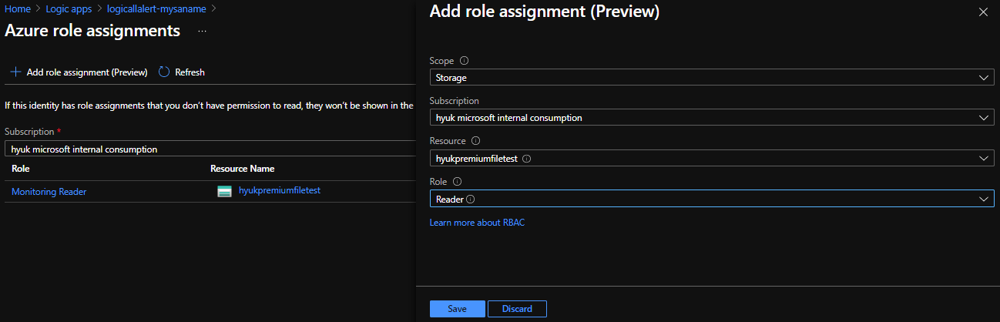
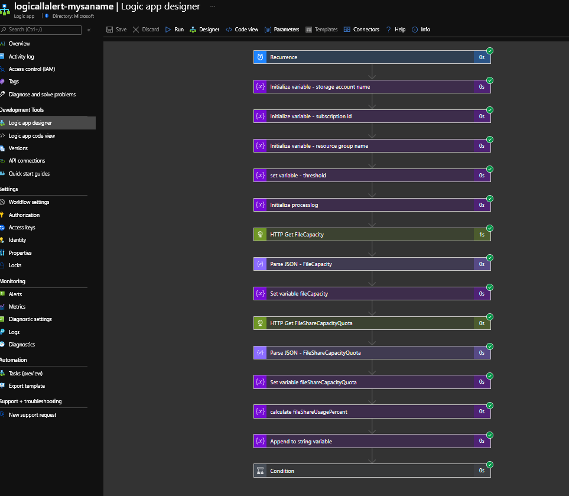
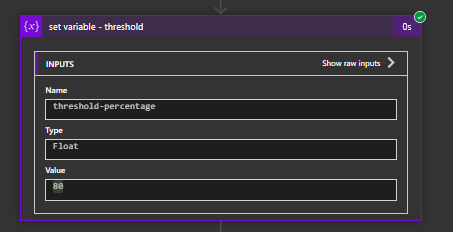
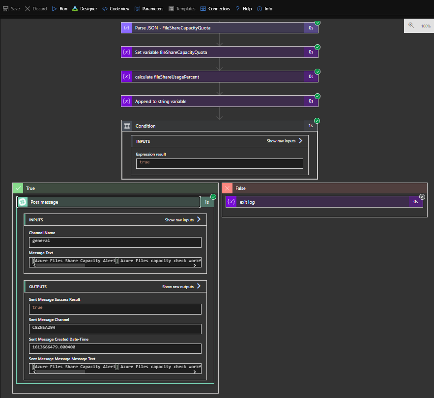
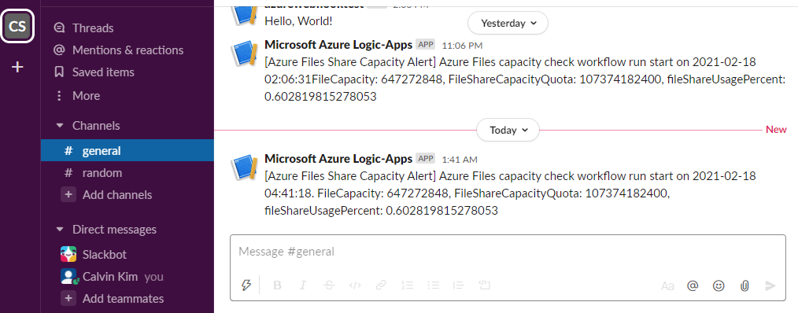

# azure-logicapp-files-capacity-alert


## 1. Overview

Azure Premium Files을 사용하려면 미리 사용할 용량을 설정해야 합니다.  이 설정된 용량에 따라 사용할 수 있는 용량 (GiB) 및 IOPS/throughput 성능이 정해집니다.

본 Logic App template은 Azure Premium Files를 사용하다가 사용 용량이 설정된 용량(fileShareCapacityQuota)의 특정 %(e.g. 80%)를 넘으면 Slack app으로 Alert을 보내는 workflow를 배포합니다. 


## 2. 배포 방법 

```ARM template
# resource group 생성 (optional)
$ az group create --name mytestrg1 --location "koreacentral"

# 해당 resource group에 아래와 같이 template을 배포
$ az deploym
ent group create --resource-group mytestrg1 --template-file ./template.json --parameters workflows_name=logicallalert-mysaname storageaccountname=hyukpremiumfiletest threshold_percentage=80
```

배포 방법은 아래와 같이 본 repository의 template.json 파일을 Azure CLI 또는 powershell을 이용하여 배포합니다. 

```bash
resource group 생성 (optional)

$ az group create --name mytestrg1 --location "koreacentral"


# 해당 resource group에 아래와 같이 template을 배포

$ az deployment group create --resource-group mytestrg1 --template-file ./template.json --parameters workflows_name=logicallalert-mysaname storageaccountname=hyukpremiumfiletest storageaccount_resourcegroup=mysa_rgname threshold_percentage=80
```


배포 시 아래의 parameter 값을 지정합니다. 

```json
{
    "$schema": "https://schema.management.azure.com/schemas/2015-01-01/deploymentParameters.json#",
    "contentVersion": "1.0.0.0",
    "parameters": {
        "workflows_name": {
            "value": "logicapp-alert-files-hyukpremiumfiletest"
        },
        "storageaccountname": {
            "value": "hyukpremiumfiletest"
        },
        "storageaccount_resourcegroup": {
            "value": "mysa_rgname"
        },
        "threshold_percentage": {
            "value": "80"
        }
    }
}
```

- workflow_name: logic app workflow 리소스 이름

- storage account name: 모니터링 대상 Azure Files Storage Account Name ("premium" SKU)

- storage account resource group name: 모니터링 대상 Azure Files Storage Account 리소스가 배포된 리소스 그룹 이름

- threshold_percentage: 현재 usage("fileCapacity")가 설정된 용량(fileShareCapacityQuota)에 대해 이 threshold_percentage 를 넘으면 Slack으로 alert을 전송

  


## 3. Slack connector 연결 


배포가 성공하면 Azure Portal의 해당 Logic App 리소스에서 "Logic app designer" 메뉴로 갑니다. 아래 그림의 왼쪽 하단과 같이 "Slack" logic app connector가 "invalid connection"으로 나타나는 것을 볼 수 있습니다. 해당 메뉴로 가서 "Add new" 버튼을 click 합니다.




아래와 같이 Logic App에서 slack 접근에 대한 권한을 요청하는 창이 뜨면 원하는 slack workspace를 선택하고  "Allow" 버튼을 눌러 승인합니다. 




아래와 같이 Alert을 보낼 slack workspace에 연결되면 Alert을 수신할 "Channel Name"을 선택합니다. 좌측 상단의 "Save" 버튼을 눌러 저장합니다. 




## 4. Storage Account의 metric에 접근 권한 부여 

"Identity" 메뉴에서 아래 그림과 같이 "System assigned" identity가 enable된 것을 볼 수 있습니다. "Azure role assignments" 버튼을 click 합니다.  




아래의 "Azure role assignments" 메뉴에서 "+ Add role assignment (Preview)" 버튼을 click하고 'Add role assignment" 창에서 아래와 같이 해당 storage account resource 를 선택하고 , Role을 "Monitoring Reader"로 선택 후 "Save" 버튼을 눌러 저장합니다.





## 5. 테스트

아래 Logic App designer 상단의 "Run" 버튼을 click하여 worflow를 수행합니다. 아래와 같이 모든 step에서 녹색의 check mark가 보이는 것을 확인합니다. 




아래와 같이 "threshold-percentage" 변수값를 변경하여 테스트 할 수 있습니다. 



아래와 같이 Slack으로의 Post가 성공하는 것을 확인합니다.



Slack app에서 아래와 같이 Alert을 확인합니다. 




감사합니다.